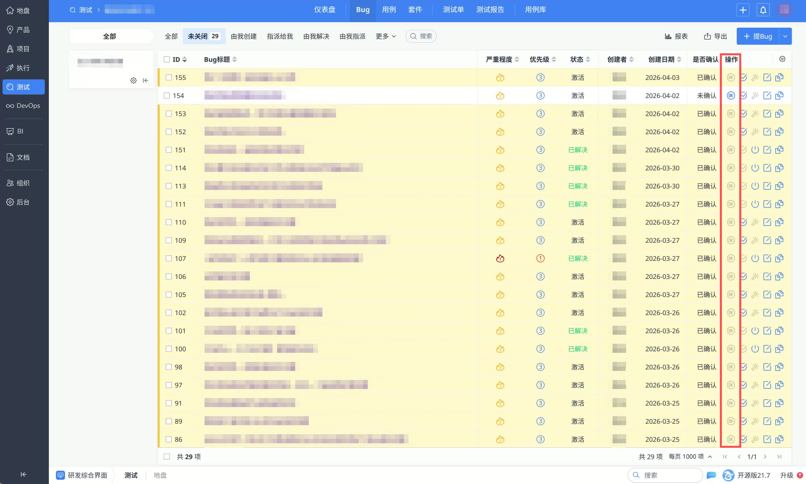

# 禅道表格-已确认高亮

一个用于禅道页面的 Tampermonkey 油猴脚本。

脚本会监听禅道 QA iframe 内的表格内容，把 `confirmed` 列中包含“已确认”的整行高亮，并在 `id` 列增加左侧强调边框，方便快速识别已确认记录。

## 效果截图



## 功能特性

- 自动等待 iframe 和表格内容加载完成后再执行
- 监听页面异步刷新，切换筛选、分页或重新渲染后会自动重新高亮
- 高亮整行，并对 `id` 列增加醒目的左侧边框
- 纯前端脚本，无额外依赖，无后端服务
- `@grant none`，不申请额外权限

## 适用场景

当前脚本基于以下页面结构编写：

- iframe 选择器为 `#appIframe-qa`
- 表格单元格结构为 `.dtable-cell[data-col][data-row]`
- 状态字段位于 `confirmed` 列
- 当单元格文本包含“已确认”时触发高亮

如果你的禅道版本、主题或自定义前端改动过 DOM 结构，可能需要同步调整脚本中的选择器。

## 效果说明

- 满足条件的整行会被设置为浅黄色背景：`#fff7cc`
- 对应 `id` 列会额外增加左侧高亮边框：`#f5c542`

## 安装方式

### 方式一：复制脚本内容安装

这是当前仓库最稳妥的安装方式。

1. 浏览器安装 Tampermonkey 扩展。
2. 打开仓库中的 `zentao-highlight.user.js`。
3. 复制完整脚本内容。
4. 打开 Tampermonkey，新建脚本。
5. 粘贴并保存。
6. 按你的禅道地址修改 `@match` 配置。

### 方式二：通过 GitHub Raw URL 导入

1. 在 GitHub 中打开 `zentao-highlight.user.js` 文件。
2. 点击 `Raw`，复制脚本原始地址。
3. 打开 Tampermonkey `Dashboard -> Utilities`。
4. 在 `Import from URL` 中粘贴 Raw 地址并导入。
5. 安装后按实际环境调整 `@match`。

## 配置说明

### 1. 修改脚本匹配地址

请把脚本头部的 `@match` 改成你自己的禅道地址，例如：

```javascript
// @match        http://zentao.example.com/index.php?*
// @match        https://zentao.example.com/index.php?*
```

如果你的禅道部署在子路径下，也需要按实际 URL 调整。

### 2. 如页面结构不同，可调整以下常量

```javascript
const IFRAME_SELECTOR = '#appIframe-qa';
const ROW_CLASS = 'tm-confirmed-row';
const ID_CLASS = 'tm-confirmed-row-id';
```

脚本还依赖以下表格选择器：

```javascript
'.dtable-cell[data-col="confirmed"][data-row]'
```

如果你的页面不是这个字段名或类名，需要一起修改。

## 工作原理

脚本启动后会执行以下流程：

1. 等待页面加载完成
2. 查找 `#appIframe-qa`
3. 监听 iframe 的 `load` 事件
4. 对 iframe 内部文档挂载 `MutationObserver`
5. 在表格内容变化时重新扫描 `confirmed` 列
6. 对文本包含“已确认”的整行单元格打上高亮样式

这样可以兼容禅道表格的异步渲染、筛选和局部刷新。

## 已知限制

- iframe 内容必须与当前页面同源，否则浏览器安全策略会阻止脚本读取内部文档
- 目前脚本依赖禅道当前的表格 DOM 结构，升级版本后可能需要微调选择器
- 仅对 `confirmed` 列文本包含“已确认”的行生效
- 安装前需要按你的实际禅道地址修改 `@match`

## 调试方法

脚本运行时会在浏览器控制台输出日志，日志前缀为：

```text
[tm-confirmed]
```

如果高亮没有生效，可以优先检查：

- iframe 选择器是否仍然是 `#appIframe-qa`
- 表格单元格是否仍然使用 `.dtable-cell`
- `confirmed` 列字段名是否变化
- 页面是否存在跨域 iframe

## 仓库结构

```text
.
├── README.md
├── pictures.png
└── zentao-highlight.user.js
```

## 发布建议

如果你准备长期放在 GitHub 维护，建议顺手再做两件事：

- 视需要补充 `LICENSE`
